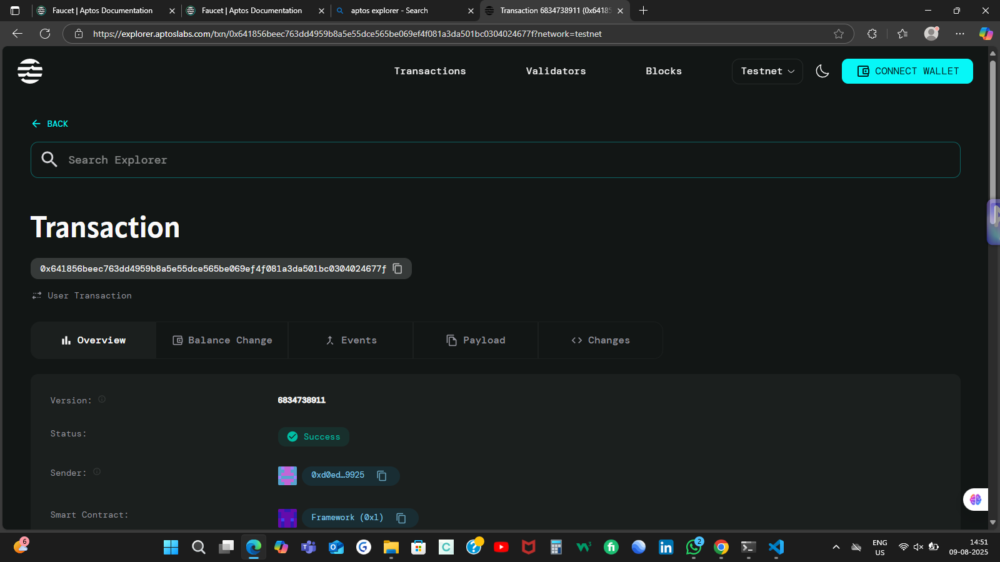

# Vesting Token Contract

## Project Description

The Vesting Token Contract is a smart contract built on the Aptos blockchain that enables the creation of linear and cliff vesting schedules for token distribution. This contract allows organizations to distribute tokens to beneficiaries over time with customizable cliff periods and linear vesting schedules, ensuring controlled and predictable token release mechanisms.

## Project Vision

Our vision is to provide a secure, transparent, and flexible token vesting solution that enables organizations, startups, and projects to implement fair token distribution strategies. By automating the vesting process through smart contracts, we eliminate the need for manual token releases and provide full transparency to all stakeholders about vesting schedules and token availability.

## Key Features

- **Linear Vesting Schedule**: Tokens are released linearly over a specified duration after the cliff period
- **Cliff Period Protection**: Configurable cliff period where no tokens are released initially
- **Automated Token Release**: Smart contract automatically calculates and releases vested tokens
- **Transparent Tracking**: Full visibility into total allocated, vested, and released token amounts
- **Beneficiary Control**: Only designated beneficiaries can claim their vested tokens
- **Time-based Calculations**: Uses blockchain timestamp for accurate vesting calculations
- **Security Features**: Built-in error handling and authorization checks
- **Gas Efficient**: Optimized contract design for minimal transaction costs

## Future Scope

### Phase 1 - Enhanced Vesting Models
- **Multiple Vesting Types**: Support for exponential, stepped, and custom vesting curves
- **Batch Operations**: Create multiple vesting schedules in a single transaction
- **Vesting Templates**: Pre-defined vesting templates for common use cases

### Phase 2 - Advanced Features
- **Revocable Vesting**: Allow contract owners to revoke unvested tokens under specific conditions
- **Multi-token Support**: Extend support beyond AptosCoin to custom tokens
- **Governance Integration**: Community voting mechanisms for vesting parameter changes

### Phase 3 - Enterprise Features
- **Multi-signature Support**: Require multiple signatures for vesting schedule creation
- **Advanced Analytics**: Detailed reporting and analytics dashboard
- **Integration APIs**: REST APIs for easy integration with external systems
- **Mobile Application**: User-friendly mobile app for beneficiaries to track and claim tokens

### Phase 4 - Ecosystem Expansion
- **Cross-chain Compatibility**: Support for vesting across multiple blockchain networks
- **DeFi Integration**: Enable vested tokens to be used as collateral in DeFi protocols
- **Compliance Tools**: Built-in compliance features for regulatory requirements
- **White-label Solutions**: Customizable vesting solutions for different organizations

## Contract Details
d0ede1465e8e00df38883f03d770302f7f8bdefa2c2442ef7b6c0bf57a139925
